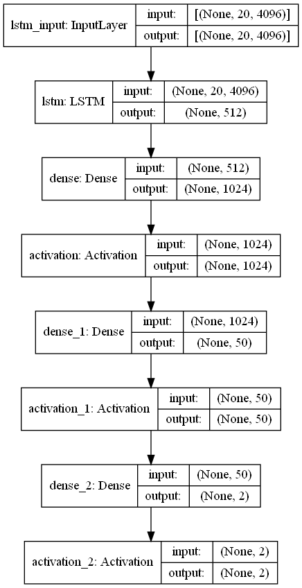
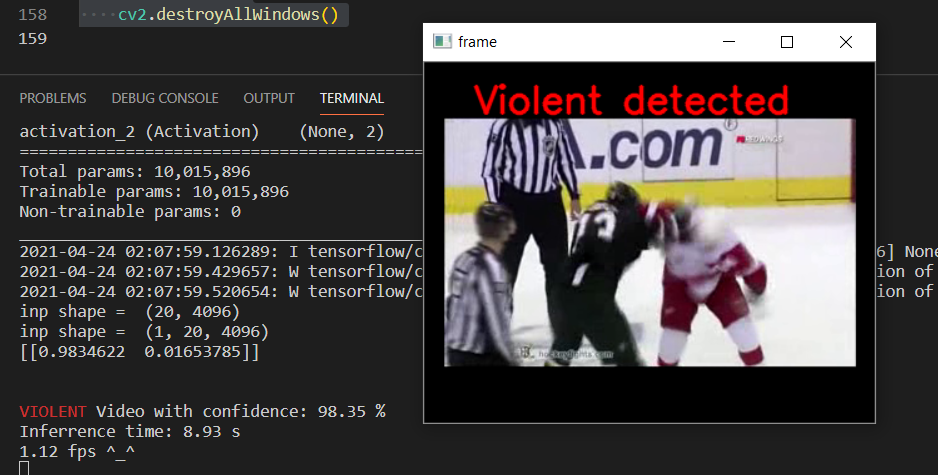
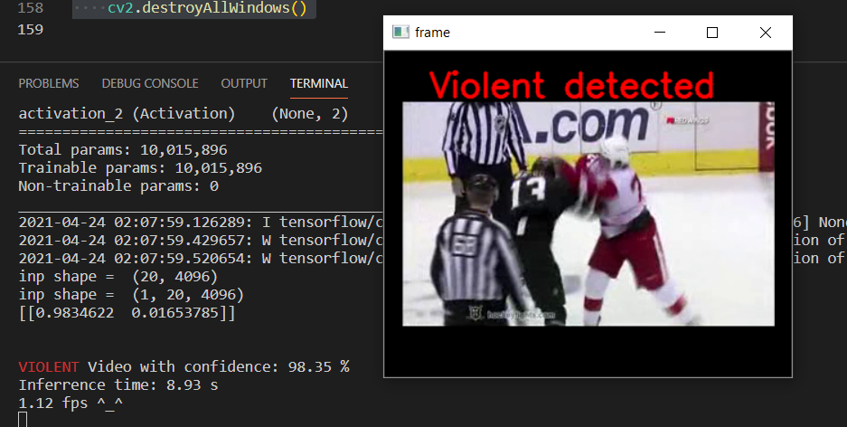
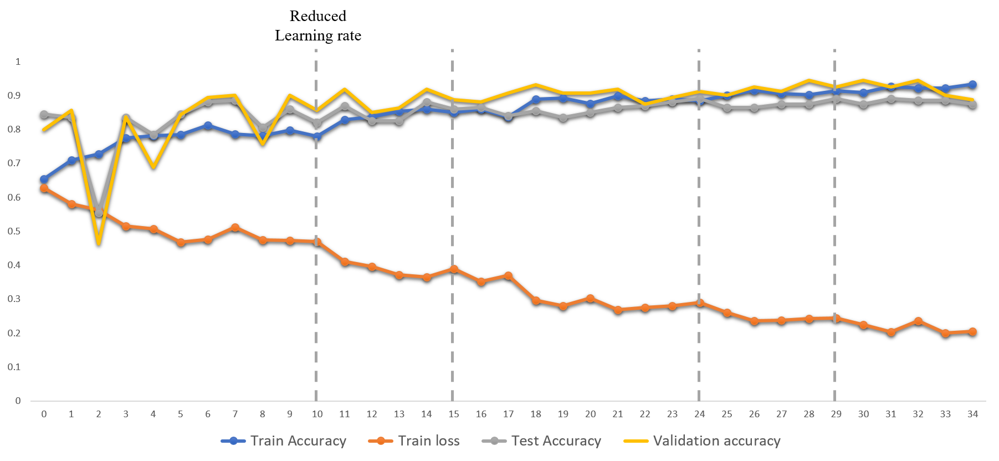

# Violence Detection using CNN LSTM

## Introduction

Today, the amount of public violence has increased dramatically. As much in high schools as in the street. This has resulted in the ubiquitous use of surveillance cameras. This has helped the authorities to identify these events and take the necessary measures. But almost all systems today require the human-inspection of these videos to identify such events, which is virtually inefficient. It is therefore necessary to have such a practical system that can automatically monitor and identify the surveillance videos. The development of various deep learning techniques, thanks to the availability of large data sets and computational resources, has resulted in a historic change in the community of computer vision. Various techniques have been developed to address problems such as object detection, recognition, tracking, action recognition, legend generation, etc.

## Architecture 

  

**Fig: Decoder Network Architecture**

## Dataset

data path are defined as follows:

- hocky - [Data_Link](http://academictorrents.com/details/38d9ed996a5a75a039b84cf8a137be794e7cee89/tech)
- violentflow - [Data_Link](https://www.openu.ac.il/home/hassner/data/violentflows/)
- movies - [Data_Link](http://academictorrents.com/details/70e0794e2292fc051a13f05ea6f5b6c16f3d3635)

## Usage of pretrained model

- Clone this repository and change directory to this repository

```bash
git clone https://github.com/manncodes/Violence-Detection-CNNLSTM.git
cd Violence-Detection-CNNLSTM
```

- Download Inbuilt Keras VGG16 model by running the following script:

```bash
python download_imagenet.py
```

- Now download the pretrained model H5 file from [here](https://drive.google.com/drive/folders/1SYD0dbfOLRBcidaACw5aiQsbtN4ySXLh?usp=sharing) and put it inside the model folder so it'll be "model/vlstm_92.h5".

- Install Dependencies

 ```bash
 pip install -r requirements.txt
 ```

- to run inference on a video existing in 'data' folder run following command:

```bash
python infer.py <Video name existing in data folder>
# Example
python infer.py fi3_xvid.avi
```

- to run inference live:

```bash
python infer_cam.py
```

Example of 2 consecutive inference of a violent video.




*to be noted better version of live inference is made by us in a different repository. Do contact me to get access to it. That repository also contains an android app for the violence detection UI.*

## Results

**Results on Hocket Dataset after hypertuning of parameters**

